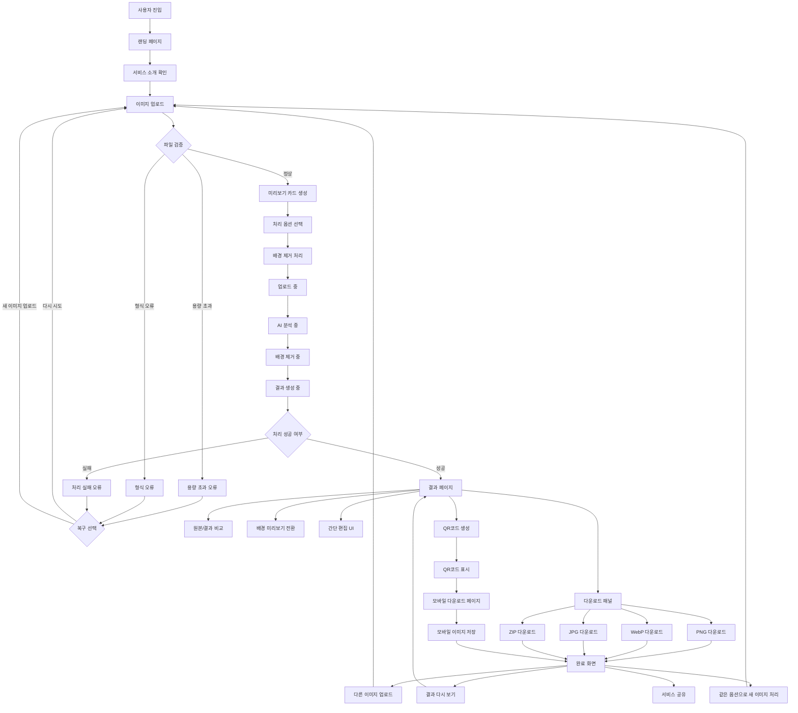

# AI 이미지 배경 제거 MVP 유저 플로우

```mermaid
flowchart TD
  A[사용자 진입] --> B[랜딩 페이지]
  B --> C[서비스 소개 확인]
  C --> D[이미지 업로드]
  D --> E{파일 검증}
  E -->|용량 초과| F[용량 초과 오류]
  E -->|형식 오류| G[형식 오류]
  F --> H{복구 선택}
  G --> H
  H -->|다시 시도| D
  H -->|새 이미지 업로드| D
  E -->|정상| I[미리보기 카드 생성]
  I --> J[처리 옵션 선택]
  J --> K[배경 제거 처리]
  K --> K1[업로드 중]
  K1 --> K2[AI 분석 중]
  K2 --> K3[배경 제거 중]
  K3 --> K4[결과 생성 중]
  K4 --> L{처리 성공 여부}
  L -->|실패| M[처리 실패 오류]
  M --> H
  L -->|성공| N[결과 페이지]
  N --> O[원본/결과 비교]
  N --> P[배경 미리보기 전환]
  N --> Q[간단 편집 UI]
  N --> R[다운로드 패널]
  R --> R1[PNG 다운로드]
  R --> R2[WebP 다운로드]
  R --> R3[JPG 다운로드]
  R --> R4[ZIP 다운로드]
  N --> S[QR코드 생성]
  S --> T[QR코드 표시]
  T --> U[모바일 다운로드 페이지]
  U --> V[모바일 이미지 저장]
  R1 --> W[완료 화면]
  R2 --> W
  R3 --> W
  R4 --> W
  V --> W
  W --> X[다른 이미지 업로드]
  W --> Y[같은 옵션으로 새 이미지 처리]
  W --> Z[결과 다시 보기]
  W --> AA[서비스 공유]
  X --> D
  Y --> D
  Z --> N
```
